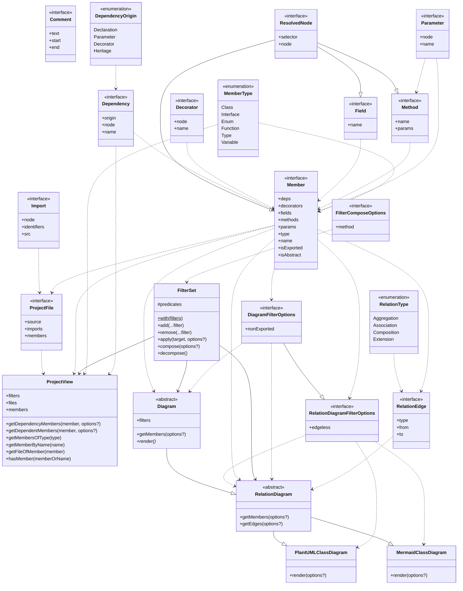

# tsplot

This project aims to provide a simple-to-use tool to automagically generate different
types of diagrams for TypeScript projects by analyzing the dependencies between files
and their members.

> [!WARNING]  
> This project is still in its early stages. Since most of the codebase is currently
> experimental, major changes shall be expected to happen!

## Usage

```bash
npx tsplot --help
```

```
Usage: tsplot [options] [command]

Options:
  -h, --help         display help for command

Commands:
  diagram [options]  Generate different types of diagrams for a typescript project based on its dependency graph
  stats [options]    Generate statistics for a typescript project
  help [command]     display help for command
```

## Examples

These are examples showcasing a class diagram for this project.

> [!NOTE]  
> The diagrams might be outdated

### Mermaid



### Plant UML


