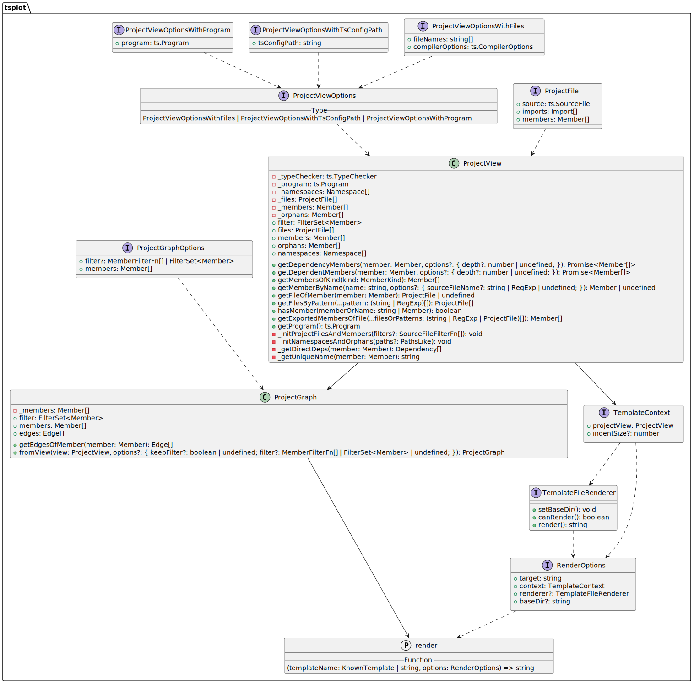

# tsplot

This project aims to provide a simple-to-use tool to automagically generate different types of diagrams for TypeScript projects by analyzing the dependencies between files and their members.

## Usage

```bash
npx tsplot --help
```

```
Usage: tsplot [options] [command]

Options:
  -h, --help                   display help for command

Commands:
  diagram [options]            DEPRECATED! use "render <template>" command instead
  stats [options]              generate statistics for a typescript project
  render [options] <template>  renders typescript AST and type checker information to a desired target format using built-in and
                               custom templates (e.g. plant-uml, mermaid)
  help [command]               display help for command
```

## Templates

There are currently two template targets available:

- [`plant-uml`](https://plantuml.com/)
- [`mermaid`](https://mermaid-js.github.io/mermaid/#/)

They can be set using the `--target` option when using the `render` command.

### Custom templates

Built-in templates are implemented using [Nunjucks](https://mozilla.github.io/nunjucks/). They are available for the `plant-uml` and `mermaid` targets and can be extended. Make sure to check the [template engine concept](https://github.com/JanUnld/tsplot/blob/main/docs/concepts/TEMPLATE_ENGINE.md) for more information.

## Example

Executing the shell command below:

```shell
npx tsplot render class-diagram \ 
  --output './example.puml' \
  --includeName 'Project*' 'Template*' 'render' 'RenderOptions' \
  --exclude '**/cli/**'
```

Generates the Plant UML code in [`example.puml`](./assets/puml/example.puml), which results in the following diagram:



A _full_ overview of this project looks like this:


